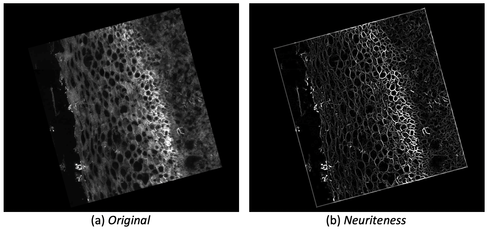
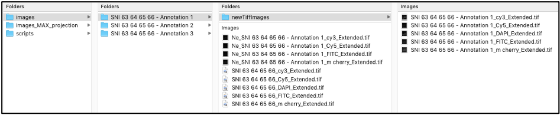
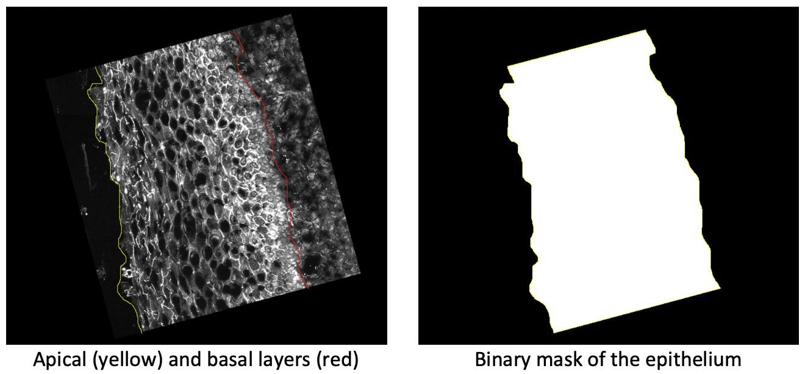
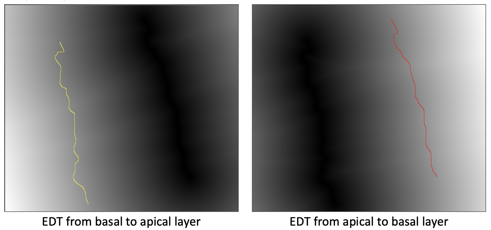

# Structural Analysis of the Cervical Epithelial Tissue

### Overview

### Software Requirements

The software listed below should be installed before running the scripts available in this repository.

* [Fiji](https://fiji.sc)
* [MorphoLibJ plugin](https://imagej.net/plugins/morpholibj) for Fiji

* [Matlab](https://se.mathworks.com/products/matlab.html) is required to run the script that generates the *neuriteness* image. The library *vesselness2d* is used to generate the enhanced neuriteness networks and is available in this [link](https://github.com/BoguslawObara/vesselness2d).

### Usage

1. Download the Git repository for this project.
2. Navigate to the downloaded git repository directory
3. To run the Fiji scripts (*.ijm*), open Fiji and go to Plugins – Macros – Edit... and browse the corresponding file. 
4. Set the parameters accordingly
5. Execute the macro by pressing the *Run* button

### Parameter set

### *Neuriteness* script

The Matlab script *batch_neuriteness.m* generates the *neuriteness* images for each fluorescent channel of each SNI using the method proposed by: Obara, Boguslaw, et al. "Contrast-independent curvilinear structure detection in biomedical images." *IEEE Transactions on Image Processing* 21.5 (2012): 2572-2581.

 The figure below shows an example of a *neuriteness* network, obtained from a sample image.

To run *batch_neuriteness.m*, load the script in Matlab and then update the corresponding local path in the *addpath* command, which should be linked to the [*vesselness2d* library](https://github.com/BoguslawObara/vesselness2d).

After updating the library path, press the *Run* button. A file browser window will appear and the input directory should be selected. Wait until all the SNIs are processed. The corresponding neuriteness images of each fluorescent channel of the input SNIs are saved in the subfolders of the input directory. The output files contain the prefix *Ne_*, as shown in the figure below.

### Support

If you find a bug, please [raise an issue](https://github.com/BIIFSweden/EpithelialNetworkAnalysis/issues/new)

### Authors

[SciLifeLab BioImage Informatics Facility (BIIF)](https://biifsweden.github.io/) project lead: Gisele Miranda

### Licence

### 4.	Maximum intensity projection pipeline for layer annotation

In order to run the *epithelial_analysis.ijm* pipeline, the apical and basal layers of the eipthelium should be manullay annotated. This can be performed on any fluorescent channel. However, in order to facilitate the annotation of the layers, the *maximum_intensity_projection.ijm* pipeline generates a maximum intensity projection for each SNI, given all the corresponding fluorescent channels (Occludin-1, ZO-1, Claudin and Desmoglein-1). The four channels are projected into a single image. The projected image can be used for manual annotation of the apical and basal layers in Fiji, since it provides a higher contrast image. 

To run the script, open Fiji and go to Plugins – Macros – Edit... and browse the corresponding file. Then, the interface showed below will appear. In line 2, there is a parameter named *useNucleiChannel*, which can be set as true or false. If true, then the DAPI channel will be included in the maximum intensity projection.

After the execution of this script, a folder will be created containing the projected images of each SNI in *tif* format, as shown below.

The *zip* files correspond to the manual annotations of the basal and apical layers of the epithelial tissue. They can be opened in Fiji using the Roi Manager tool. The *maximum_intensity_projection.ijm* script also generates a new folder inside each SNI folder named newTiffImages, saving the input channels in a non-tile *tiff* format. 

Note that the scripts *batch_neuriteness.m* and *maximum_intensity_projection.ijm* can be run in any order. 

The figure below shows the updated version of input directory, which is now ready to be processed in the next step.

### 5.	Quantitative analysis of the cervical epithelium

The workflow implemented in the *epithelial_analysis.ijm* script can be summarized in the following steps:

* Segmentation of the epithelium;
* Calculation of the epithelium height based on Euclidean distance transform (EDT);
* Segmentation of the neuriteness network for each fluorescent marker;
* Quantification of the segmented neuriteness;
* Calculation of the distance between the segmented fluorescent marker to the apical and basal layers;
* Segmentation and quantification of the intact net;

#### a.	Segmentation of the epithelium

The segmentation of the epithelium is performed using the manual annotations of the basal and apical layers. These two layers are connected in order to obtain a polygon, which corresponds to the binary mask of the epithelium as illustrated below.

#### b.	Obtaining the epithelium height based on EDT

The calculation of the epithelium height is performed using the Euclidean distance transform from the basal layer towards the apical layer, and, from the apical layer towards the basal layer, as shown in the image below, repectively. The distance values in in the yellow and red lines will be averaged, generating then the final value for the epithelium height.

#### c. Segmentation of the neuriteness image

Otsu threshold is used for the segmentation of the neuriteness image. In addition, it is also possible to set a correction factor for the threshold value, allowing a few adjustments in the final segmentation result. In Fig. 12, we can observe the effect of different values of the correction factor.

After thresholding, the EDT map is generated from the segmented neuriteness. A distance threshold is then defined in order to obtain a binary mask corresponding to the final segmented region. The distance threshold is a parameter of this workflow. Segmented regions using different distance threshold values can be seen in the figure below

Notice that, the EDT transform is now applied on the thresholded neuriteness. The same transform is applied on the apical and basal layers to calculate the epithelium height, as explained in section 6.3.

