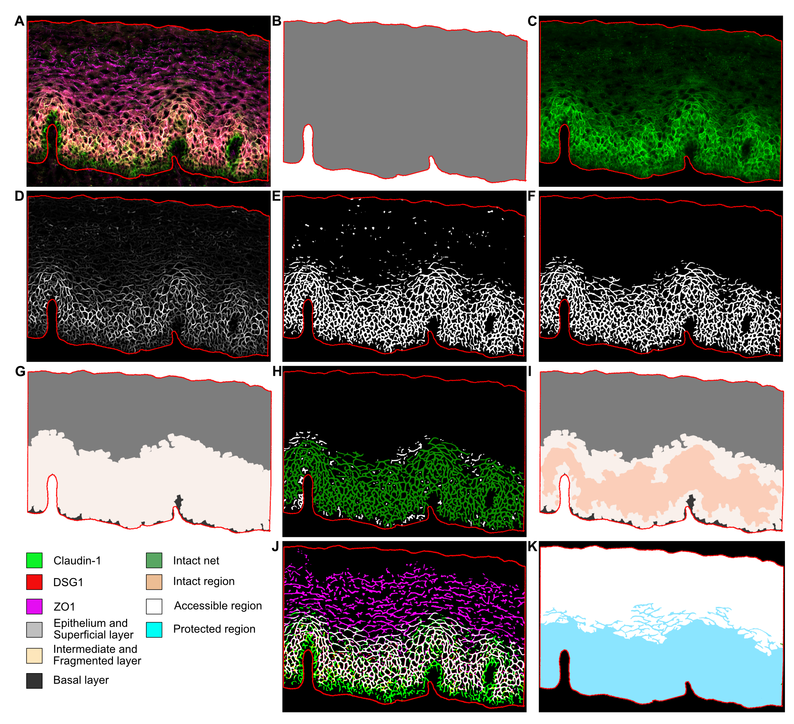

# Structural Analysis of the Cervical Epithelial Tissue

### Overview
Epithelial cells express a variety of epithelial junction proteins which are crucial for maintaining the organization and structural integrity of the epithelium. Additionally, these proteins also provide an important physical barrier preventing entry of incoming pathogens which have been demonstrated for a variety of viruses including HIV and HPV. A disrupted or dysregulated epithelial compartment might therefore increase the risk of acquiring sexually transmitted infections. It is therefore important to better understand how different factors such as infections, treatments or other interventions might influence the epithelial barrier to better understand the potential susceptibility to infections. This workflow was therefore developed to investigate the structural integrity of the stratified squamous epithelium of the ectocervix. Although it has yet only been tested on the epithelium of the ectocervix and vagina we believe that it would likely work on other epithelial compartments with a similar morphology, such as the skin.

### Software Requirements

The software listed below should be installed before running the scripts available in this repository.

* [Fiji](https://fiji.sc)
* [MorphoLibJ plugin](https://imagej.net/plugins/morpholibj) for Fiji
* [Multi Otsu Threshold](https://imagej.net/plugins/multi-otsu-threshold)
* [Matlab](https://se.mathworks.com/products/matlab.html) is required to run the script that generates the *neuriteness* image. The library *vesselness2d* is used to generate the enhanced neuriteness networks and is available in this [link](https://github.com/BoguslawObara/vesselness2d).

### Usage

1. Download the Git repository for this project.
2. Navigate to the downloaded git repository directory
3. To run the Fiji scripts (*.ijm*), open Fiji and go to Plugins – Macros – Edit... and browse the corresponding file. 
4. Set the parameters accordingly
5. Execute the macro by pressing the *Run* button

### Parameter set

### *Neuriteness* script

The Matlab script *batch_neuriteness.m* generates the *neuriteness* images for each fluorescent channel of each SNI using the method proposed by: Obara, Boguslaw, et al. "Contrast-independent curvilinear structure detection in biomedical images." *IEEE Transactions on Image Processing* 21.5 (2012): 2572-2581.

To run *batch_neuriteness.m*, load the script in Matlab and then update the corresponding local path in the *addpath* command, which should be linked to the [*vesselness2d* library](https://github.com/BoguslawObara/vesselness2d). The corresponding neuriteness images of each fluorescent channel are saved in the subfolders of the input directory. 

### Support

If you find a bug, please [raise an issue](https://github.com/BIIFSweden/EpithelialNetworkAnalysis/issues/new)

### Authors

[SciLifeLab BioImage Informatics Facility (BIIF)](https://biifsweden.github.io/) project lead: Gisele Miranda

### Licence

