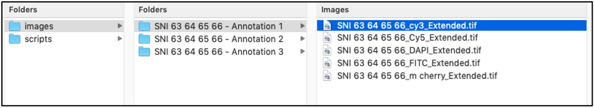
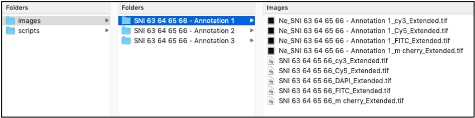
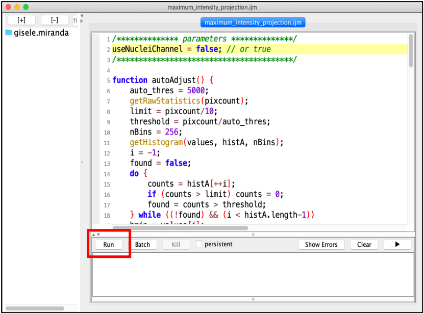
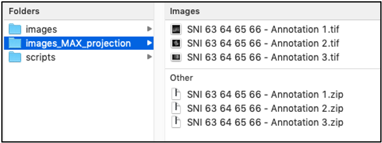

# Structural Analysis of the cervical Epithelial Tissue

### 1.	Input directory and naming convetion

The input directory should contain the SNIs. Each subfolder of the input directory corresponds to a single SNI and it should contain all the fluorescent channels saved as *tif* files. The names of the subfolders must start with *SNI* or *Neg SNI* in the case of negative controls. The input directory template is illustrated below. 

### 2.	Software requirements

The software listed below should be installed before running the scripts available in the repository. 

* [Fiji](https://fiji.sc): follow the instructions in the link to download Fiji.
* [MorphoLibJ plugin](https://imagej.net/plugins/morpholibj): follow the instructions in the link to install MorphoLibJ plugin.

To run the script that generates the *neuriteness* image, [Matlab](https://se.mathworks.com/products/matlab.html) is required. The library *vesselness2d* is used to generate the enhanced neuriteness networks and is available in this [link](https://github.com/BoguslawObara/vesselness2d).

### 3.	Neuriteness script

The Matlab script *batch_neuriteness.m* generates the *neuriteness* images for each fluorescent channel of each SNI using the method proposed by: Obara, Boguslaw, et al. "Contrast-independent curvilinear structure detection in biomedical images." *IEEE Transactions on Image Processing* 21.5 (2012): 2572-2581.

To run *batch_neuriteness.m*, load the script in Matlab and then update the corresponding local path in the *addpath* command, which should be linked to the [*vesselness2d* library](https://github.com/BoguslawObara/vesselness2d).

After updating the library path, press the *Run* button. A file browser window will appear and the input directory should be selected. Wait until all the SNIs are processed. The corresponding neuriteness images of each fluorescent channel of the input SNIs are saved in the subfolders of the input directory. The output file names contain the prefix *Ne_*, as shown in the figure below.

### 4.	Maximum intensity projection pipeline for layer annotation

In order to run the *epithelial_analysis.ijm* pipeline, the apical and basal layers of the eipthelium should be manullay annotated. This can be performed on any fluorescent channel. However, in order to facilitate the annotation of the layers, the *maximum_intensity_projection.ijm* pipeline generates a maximum intensity projection for each SNI, given all the corresponding fluorescent channels (Occludin-1, ZO-1, Claudin and Desmoglein-1). The four channels are projected into a single image. The projected image can be used for manual annotation of the apical and basal layers in Fiji, since it provides a higher contrast image. 

To run the script, open Fiji and go to Plugins – Macros – Edit... and browse the corresponding file. Then, the interface showed below will appear. In line 2, there is a parameter named *useNucleiChannel*, which can be set as true or false. If true, then the DAPI channel will be included in the maximum intensity projection.

After the execution of this script, a folder will be created containing the projected images of each SNI in tif format. An updated version of the input directory is shown below.

